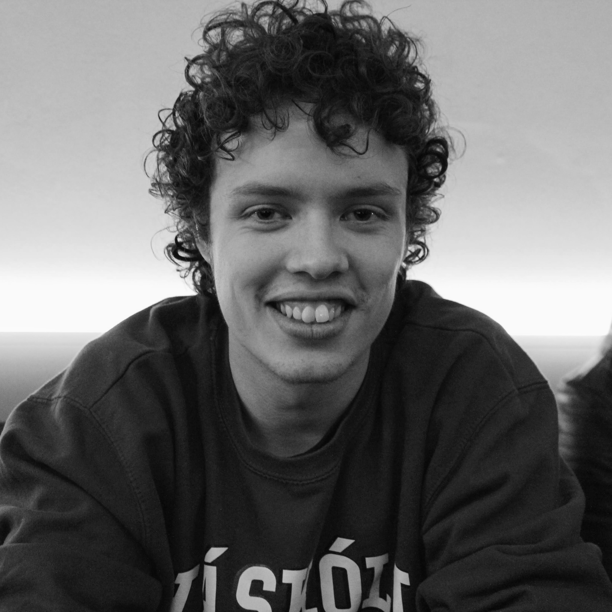

# Þorvaldur Tumi Baldursson

    
    
Fæddur: 6. sept 2001

    
Nám: tölvunarfræði HÍ

    
Sími: 6660603

    
Email: thorvaldur.tumi@gmail.com

    
Vefsíða: <a href="https://sjomli.is">sjomli.is</a>

## Starfsreynsla
---
### Tæknistjóri - Hannesarholt
**2020-núna**  
Ég byrjaði sem tæknistjóri hjá tónlistar- og menningarhúsinu Hannesarholti til hliðar skóla í október 2020. Í upphafi var ég að aðalega að uppfæra vefsíðu Hannesarholts og sjá um tæknimál og streymi á tónleikum. Ég hóf svo fullt starf eftir útskrift í desember 2020 og sá um að smíða tæknilausnir fyrir vefinn og sögusýningu sem var haldin á þeim tíma. Ég hélt stöðunni minni í Hannesarholti eftir sumarið 2021 og hef unnið hlutastarf með skóla síðan þá.

---

### Flokkstjóri - Háskóli Íslands
**2019-2020**  
Tók við stöðu flokkstjóra hjá garðyrkjudeild HÍ sumarið 2019 og kom aftur sumarið 2020 til að halda stöðunni. Ég var yfir hópi af fólki sem taldi um 12 manns, mest jafnaldrar mínir eða aðeins yngra fólk. Starfið fól í sér að passa að verkefni væru framkvæmd rétt, auk þess að bera ábyrgð á fólkinu sem vann þau.

---

### Garðykjumaður - Háskóli Íslands
**2017-2018**  
Ég starfaði sem garðykjumaður hjá garðyrkjudeild Háskóla Íslands tvö sumur, 2017 og -18. Starfið fól í sér ýmis krefjandi verkefni í allskonar veðuraðstæðum. Þrátt fyrir að veðrið hafi ekki alltaf verið sem best, sótti ég þetta starf með 100% mætingu.

---

### Aðstoðarþjálfari - Íþróttafélag Reykjavíkur
**2016 - 2020**  
Ég vann sem aðstoðarþjálfari hjá fimleika- og frjálsíþróttadeildum ÍR með skóla frá því snemma um haustið 2016 að vori 2020. Hóparnir sem ég þjálfaði voru á aldursbilunum 6-8 ára annarsvegar og 11-13 ára hinsvegar.

## Önnur reynsla

---

### Tæknikunnátta
Ég er að læra tölvunarfræði í **HÍ** þar sem ég fæ kennslu í klassískri forritun, en hef verið að forrita lengur en það. Mín helstu áhugasvið liggja í framenda-, tölvuleikja- og vélbúnaðarforritun. Forritunarmálin sem ég kann best telja til **Python**, **Java**, **C#**, **SQL**, **Ribbit**, **Javascript**/**Typescript**, **CSS**, **SCSS** og **Sass**. Þau framework sem ég er að notast mest við í framenda eru svo **NodeJS**, **React**, **NextJS**, **Django** og **express**. Þetta eru bara þau framework og mál sem ég þekki best, svo er ég alltaf að fikta eitthvað með nýtt í frítímanum mínum.

---

### Félagsstörf 
Ég hef  í gegn um alla mína skólagöngu verið virkur þáttakandi í félagsstörfum. Þegar covid skall á ákvað ég að læra á streymi og sá um að halda viðburði yfir netið fyrir **Nemendafélg MH** og **Hitt Húsið**. Ég er góður í samskiptum við annað fólk og hef ágæta reynslu af því að koma fram fyrir stóra hópa af fólki. Ég sit núna sem skemmtanastjóri í stjórn **Nemendafélags Tölvunar- og Hugbúnaðarverkfræðinga Háskóla Íslands** eða **Nörd** eins og það er betur þekkt.

---

### Tónlist
Ég hef æft tónlist mjög lengi og í nokkrum mismunandi skólum. Ég lærði á klassísk píanó hjá **Nýja Tónlistarskólanum** í þrjú ár, á rafbassa hjá **Skólahljómsveit Kópavogs** í sjö ár og svo aftur á rafbassa hjá **Tónlistarskóla FíH** í tvö ár þar sem ég náði mér í miðpróf á rythmískan rafmagnsbassa. Nýlega hef ég verið að spila með hljómsveitinni **Sameheads**. Við lentum í 3. sæti í músíktilraunum núna vorið 2022.

---

### Íþróttir
Ég hef stundað íþróttir síðan ég man eftir mér, fyrst fimleika með **Ármanni** og svo frjálsar hjá **ÍR**. Mestur fókus hjá mér síðustu ár hefur verið stangarstökk og það borgaði sig þar sem mér tókst að verða Íslandsmeistari 3 ár í röð.

---

## Menntun
**2021-núna** Háskóli Íslands  
**2017-2020** Menntaskólinn við Hamrahlíð - *Stúdentspróf á Náttúrufræðibraut*  
**2017-2019** Tónlistarskóli FÍH - *Miðpróf í rythmískum bassaleik og tónfræði*  
**2007-2017** Álfhólsskóli - *Grunnskólapróf* 