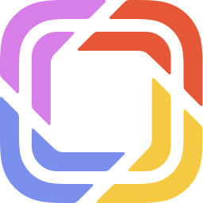
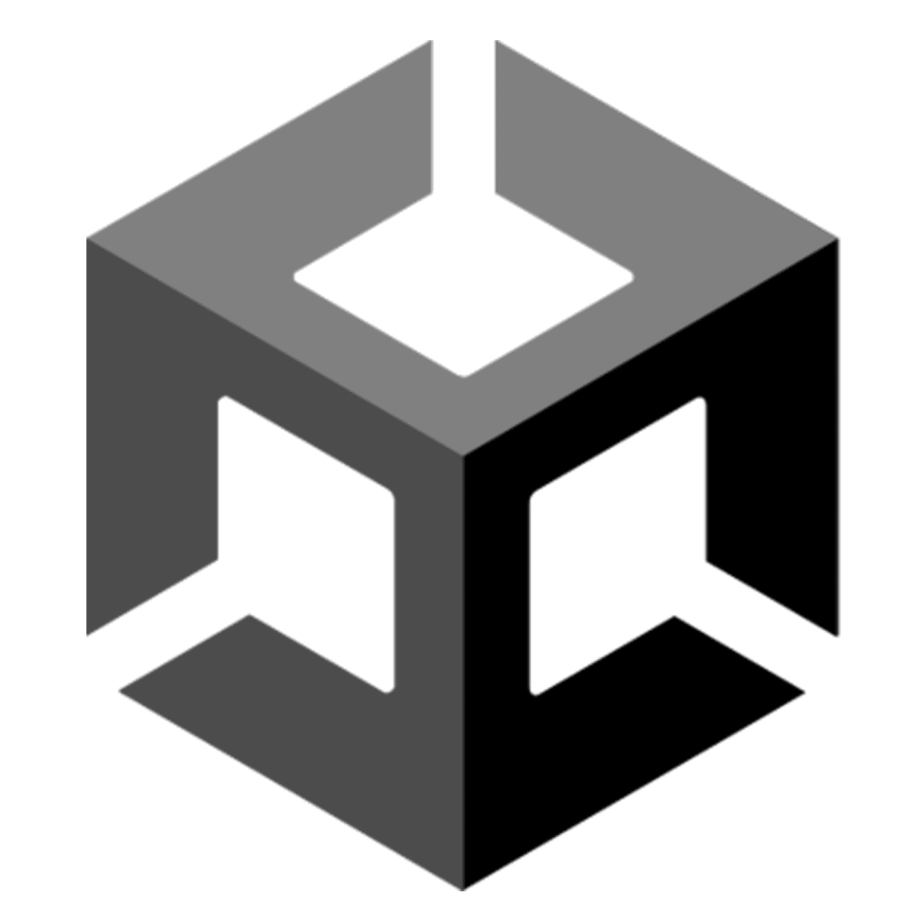

# góðan og blessaðan, ég er Tumi

tölvunarfræðinemi við HÍ með rjúkandi áhuga á vef- og tölvuleikjaforritun. öll mín verkefni eru opin hér fyrir fólk að sjá og fyrir samnemendur mína til að fá *innblástur*
* 🌠 að reyna læra það sem ég get, alltaf spenntur fyrir næsta verkefni
* 📖 open source, það sem ég geri á fólk að geta séð
* 🏕 alltaf að leita að ehv til að fara með í útilegu
* 💻 tækni sem ég er að vinna með í augnablikinu:
  * 🌐 mikið að fikta í [Svelte](https://svelte.dev) en vinn mest með [React](https://reactjs.org) og [Prismic](https://prismic.io)
  * 🎮 nota [Unity](https://unity.com) og js canvas fyrir leikjagerð og ýmsar myndrænar tilraunir
  * ⚙️ er að reyna læra [Rust](https://rust-lang.org) on the side fyrir stærri verkefni, er að gera mig létt brjálaðan :) 
* 📫 hafðu samband, upplýsingar á [síðunni minni](https://sjomli.is)

 
 
 
 
 

