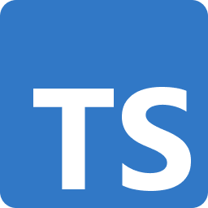
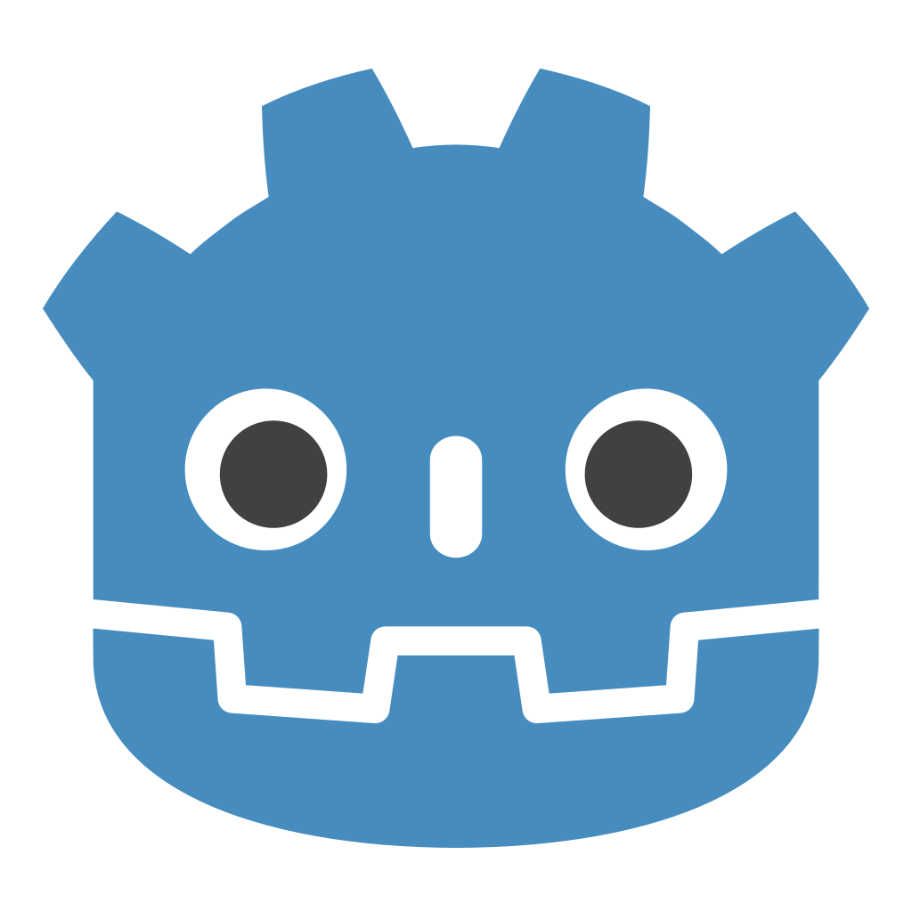

# góðan og blessaðan, ég er Tumi

[tölvunarfræðingur](https://www.tiktok.com/@tunfiskur/video/7380758526542499105?is_from_webapp=1&sender_device=pc&web_id=7405160527288911393) með fókus á vef- og viðmótsforritun. öll mín persónulegu verkefni eru opin hér fyrir fólk að sjá og fyrir nemendur til að fá *innblástur*
* 🌠 reyni að deila öllu því sem ég læri og nýt þess að skrifa kennsluefni fyrir sjálfan mig og aðra
* 📖 open source, það sem ég geri á fólk að geta séð
* 🧗 alltaf að leita að fólki til að koma með og klifra
* 💻 tækni sem ég er að vinna með í augnablikinu:
  * 🌐 mín persónulegu verkefni eru flest í [**Svelte**](https://svelte.dev) og [**Typescript**](https://typescriptlang.org) en vinn mest með [**React**](https://reactjs.org) og [**NextJS**](https://nextjs.org)
  * 🎮 hef verið að leika mér að gera litla leiki og tilraunir [**Godot**](https://godotengine.org) og [**Bevy**](https://bevyengine.org)  
  * ⚙️ elska [**Rust**](https://rust-lang.org) og langar að nota það ennþá meira
* 📫 hafðu samband, upplýsingar á [**síðunni minni**](https://sjomli.is)

 
 
 
 
 

